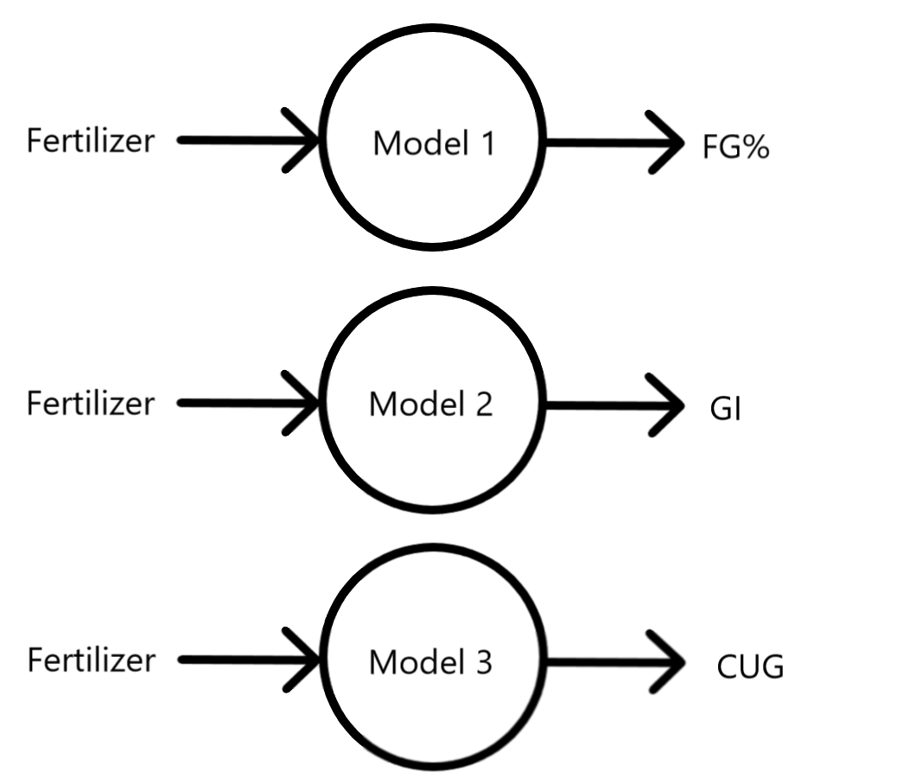
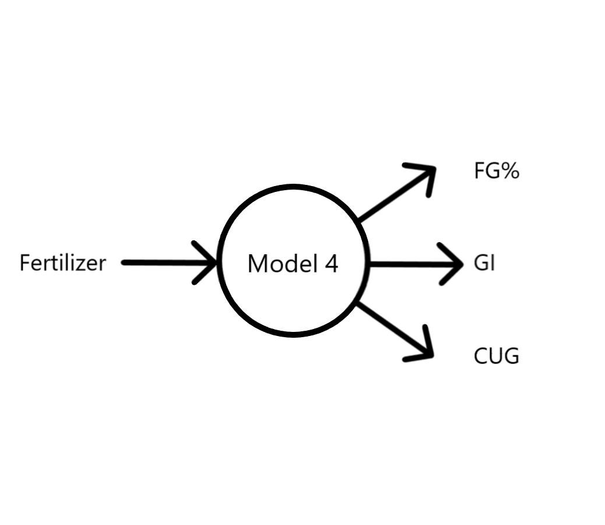
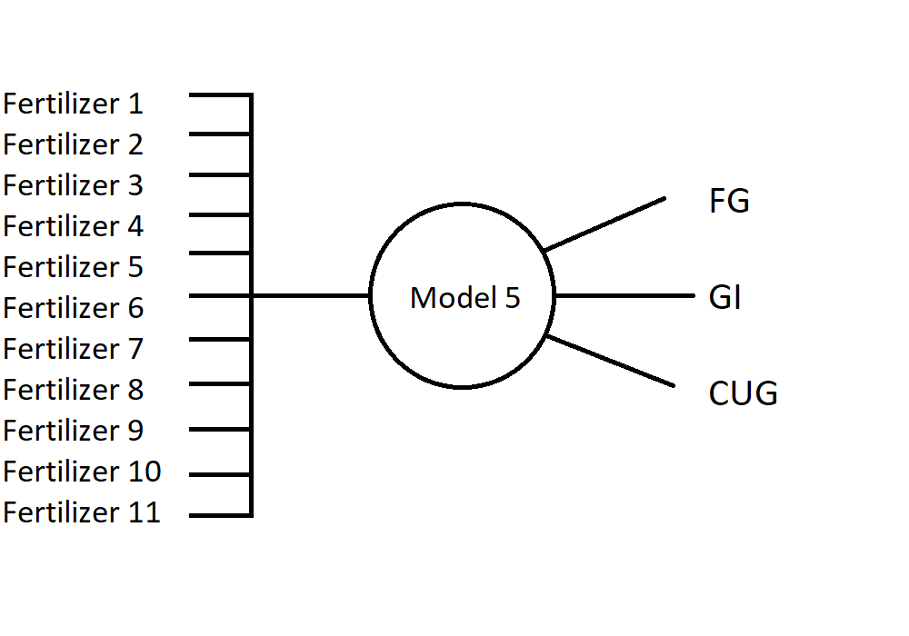

# model-beet-budding
Licensed under the Apache License, Version 2.0
Title: Modeling the budding process of the beet plant with neural networks

In order for the Scripts to function, the input and output data must be present in the MATLAB workspace.
To do so either drag and drop the data or use the command load (e.g. load('Model 1 Data.mat')).

