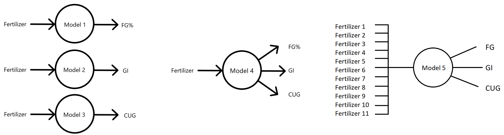

# Modeling the behavior of Beet’s seeds in budding period with neural networks

## Problem Statement
The objective of this research is to study the effect of different variables on
the budding process of the beet plant.
The variables are 11 different types of fertilizers.
The land considered for the experiment was divided into 12 areas
of the same size, the plants were planted and were treated the same way
except for the fertilizer. One of the areas was considered as control area
and the others did receive different treatments of the fertilizers. The
progress of the plant’s budding was measured with three different criterion
including FG%, GI and CUG and the measurements were repeated 10 times. The final step was
analyzing the data to study the effect of the fertilizers on the budding of the
plants.

## Network Architecture
The network chosen for this task is the Multi-layer Perceptron (MLP) variant
of the Shallow Feedforward Neural Network.
Five different model were created with different configurations, Levenberg-Marquardt 
Algorithm (LMA) was used to train the network and adjust the weights.
Number of hidden layer neurons of all the five networks: 12, 12, 12, 12, 28

The models schemas are as follows:

## Note
In order for the Scripts to function, the input and output data must be present in the MATLAB workspace.
To do so either drag and drop the data or use the command 'load' (e.g. load('Model 1 Data.mat')).

Hamed Rezayat, August 2018
Licensed under the Apache License, Version 2.0
